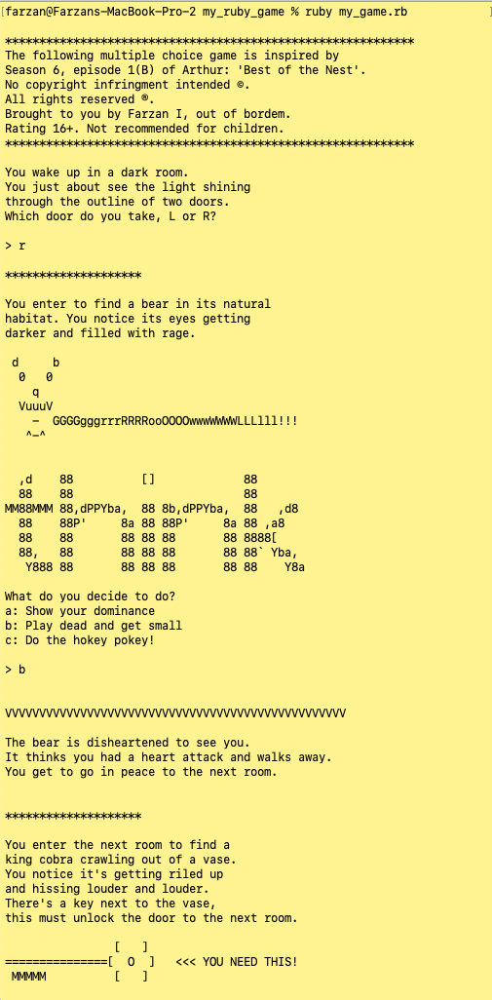

# Pointless Quest Terminal Game

## Introduction
This is my very first game that was made with the help of Zed Shaw's [Learn Ruby the Hard Way Book](https://www.amazon.co.uk/Learn-Ruby-Hard-Way-Computational/dp/032188499X).  

It is a command line terminal game that has various different scenarios and outputs depending on the multiple choice answer you give. 

The hero (you) can navigate through the different rooms and characters that you meet and try to reach the final goal, to complete this pointless quest without dying! 

## Set up
1. Fork this repo
2. Clone it to your local machine in your desired folder
3. Run `ruby my_game.rb` in the command line terminal
4. Sit back and enjoy the quest
5. (Optional) have a look at the screenshots below to know most of the answers for the quest
6. (Optional) keep playing and try to visit every room at least once, without dying in between

## Future integration
* Would love to be able to subsitute the drawings that I did and the ASCII art I found online with animated ASCII or better yet get this to be a web based game
* Have more rooms to provide hours of pointless entertainment 

## Edge case
* If a user puts an input that is not recognised they immediately die (helps their learning in the long run 😉 )

## Thanks for reading and I value any feedback that you may have!

## Demo
### Brief demo of the game being played on the terminal
#### Start of the game

#### Continued gameplay

#### Continued gameplay

#### Continued gameplay

